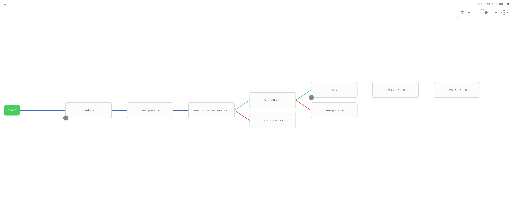

# One-Time Provisioning environments and initial configuration
These tasks will only need to be run one time, and are already run for you if you are not restoring from a backup of Tower, and are still using the Three Tier App and OSP that I have set up.

### Provision and Configure Development environment
To provision the OpenStack cluster that will be used to provision the dev environments, you will need to run 2 playbooks, and configure a single GUID in an inventory.

* Browse to templates, and launch the `Order OpenStack` Job Template. This will tell OpenTLC to request a new OpenStack for Ansible environment.
* After the OpenStack environment is accessible, you will need to determine its GUID from OpenTLC directly as this is not an AWS instance.
* Once you have the GUID, you will need to modify one inventory in Tower. Go to Inventories->OSP Bastion->Hosts, and edit the single host there to be workstation-<GUID>.rhpds.opentlc.com.
* Then browse to templates, and launch the `Configure OSP Bastion` Job Template. This will finish configuring the jumpbox, and allow Ansible Tower to configure OpenStack, and provision the dev environments.

### Provision and Configure Production environment
To provision a Three Tier Application on AWS for production use, you just need to run 2 playbooks.
* Browse to templates, and launch the `Provision Prod` Job Template. This will tell OpenTLC to request a new Three Tier App environment from AWS.
* After that provisioning is complete, and the machines are brought fully online (you may need to verify their status yourself), you should launch the `Copy Prod Key` Job Template. This will grab the required ssh key for connecting to the Three Tier App environment, and install it into a credential in Ansible Tower.

# Running the CI/CD Pipeline
The entire pipeline which is comprised of several playbooks is outlined in the picture below.

1. The process starts by ensuring the latest copy of the playbooks are grabbed from github.
2. It then ensures that the development testing environment is clean by fully removing it from OpenStack.
3. A new dev environment is then created.
    1. If this fails, it will stop the pipeline, and proceed to delete the dev environment.
4. If the provisioning was successful, it will proceed to install the three tier application onto the dev environment. At the end of the installation, a smoke test is run to verify that the servers are hosting the appropriate content.
    1. If this fails, it will stop the pipeline, and proceed to delete the dev environment.
5. If all has gone well at this point, we can assume that the dev test was successful, and will proceed to deploy to the production environment. The AWS inventory will be updated to ensure it has access to the correct hosts.
6. It will then proceed to deploy the Three Tier Application to the production environment, followed by the same smoke tests.
    1. If the smoke tests fail, it will clean up the production environment, but leave the AWS instances running.

## Provision QA Dev Test
Provisioning the Dev environment consists of running a series of roles to set up OpenStack, and then create 4 instances on it. These instances are frontend, app1, app2, and db.
When installing the Three Tier Application, it uses an in-memory inventory, obtained from openstack, to install the various services required for the application.
After the installation finishes, a smoke test is run against the frontend server to check if it is hosting content, and if that content is correct (has the word 'Ansible' in it).

## Provision Production Environment
The production environment only gets provisioned once on AWS, and the servers are reused by cleaning the installed packages, and files that were left from the deployment of the Three Tier Application.
The inventory is acquired dynamically from AWS, using instance filters and group tags.
After the installation finishes, a smoke test is run against the frontend server to check if it is hosting content, and if that content is correct (has the word 'Ansible' in it).